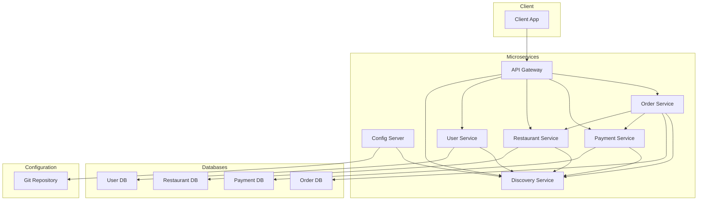

# Food Ordering System - Microservice Architecture

This project implements a food ordering system using a microservice architecture with Spring Boot and Spring Cloud.

## Project Overview

The system is composed of several microservices that work together to provide a complete food ordering platform. Each service is responsible for a specific business capability and can be developed, deployed, and scaled independently.

## Architecture Diagram



## Microservice Architecture

The architecture consists of the following key services:

- **API Gateway**: The single entry point for all client requests. It routes requests to the appropriate microservice and can also be used for cross-cutting concerns like authentication, logging, and rate limiting.
- **Discovery Service (Eureka)**: Allows services to register themselves and discover other services dynamically. This is crucial for a distributed system where service instances can change.
- **Config Server**: Provides centralized configuration management for all microservices. This allows for managing configuration in a single place and updating it without restarting the services.
- **Order Service**: Handles all order-related operations, including creating, updating, and retrieving orders.
- **Payment Service**: Manages payment processing and integrates with payment gateways.
- **Restaurant Service**: Manages restaurant information, including menus, opening hours, and locations.
- **User Service**: Handles user authentication, registration, and profile management.

### Service Interaction Flow

1.  A user interacts with the system through a client application (e.g., a web or mobile app).
2.  All requests from the client are sent to the **API Gateway**.
3.  The **API Gateway** forwards the requests to the appropriate microservice. For example:
    - A request to `/api/users/**` is routed to the **User Service**.
    - A request to `/api/restaurants/**` is routed to the **Restaurant Service**.
    - A request to `/api/orders/**` is routed to the **Order Service**.
4.  The services communicate with each other as needed. For example, when an order is placed, the **Order Service** may communicate with the **Restaurant Service** to verify menu items and with the **Payment Service** to process the payment.
5.  All services are registered with the **Discovery Service**, allowing them to find each other by service name instead of hardcoded IP addresses and ports.
6.  All services retrieve their configuration from the **Config Server** on startup.

## How to Run the System for Developers

To run the system locally for development, you will need to have Java, Maven, and Docker installed.

### 1. Clone the Repository

```bash
git clone <repository-url>
cd food-ordering-system
```

### 2. Build the Project

Build the entire project from the root directory using Maven:

```bash
mvn clean install
```

### 3. Run the Services

You can run each microservice as a Spring Boot application. You can do this from your IDE or by using the command line.

To run a service from the command line, navigate to the service's directory and run the following command:

```bash
mvn spring-boot:run
```

It is recommended to start the services in the following order:

1.  **Discovery Service**:
    ```bash
    cd discovery-service
    mvn spring-boot:run
    ```
2.  **Config Server**:
    ```bash
    cd config-server
    mvn spring-boot:run
    ```
3.  **User Service**:
    ```bash
    cd user-service
    mvn spring-boot:run
    ```
4.  **Restaurant Service**:
    ```bash
    cd restaurant-service
    mvn spring-boot:run
    ```
5.  **Order Service**:
    ```bash
    cd order-service
    mvn spring-boot:run
    ```
6.  **Payment Service**:
    ```bash
    cd payment-service
    mvn spring-boot:run
    ```
7.  **API Gateway**:
    ```bash
    cd api-gateway
    mvn spring-boot:run
    ```

### 4. Using Docker Compose (Optional)

For a more streamlined approach, you can use Docker Compose to run all the services at once. You would need to create a `docker-compose.yml` file and a `Dockerfile` for each service.

## Technologies Used

- **Java**: 24
- **Spring Boot**: 4.1.0
- **Spring Cloud**: 2025.1.2
- **Maven**: For dependency management and building the project.
- **PostgreSQL**: As the database for the services that require persistence.
- **Eureka**: For service discovery.
- **Spring Cloud Config**: For centralized configuration.
- **Spring Cloud Gateway**: For the API Gateway.
- **Git**: For version control and as the backend for the Config Server.
